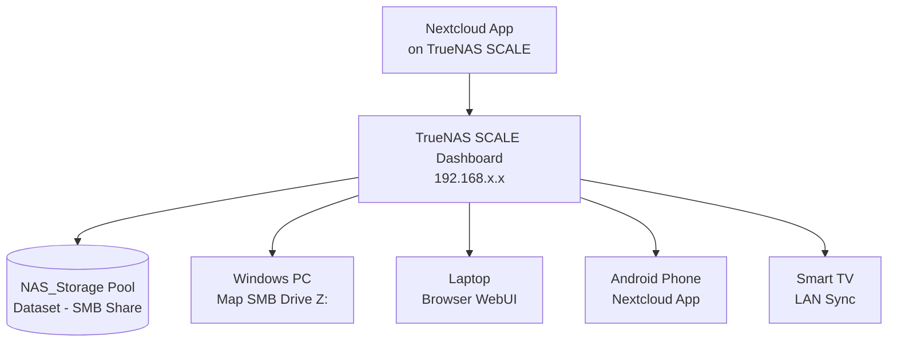

# Self-Hosted Home Server

> Repurposed old hard drives into a private, self-hosted cloud storage system - no subscriptions, no external providers, full control.

## Table of Contents

- [Overview](#overview)
- [Hardware Used](#hardware-used)
- [Architecture](#architecture)
- [Features](#features)
- [Screenshots](#screenshots)
- [Setup Guide](#setup-guide)
- [Tools & Technologies](#tools--technologies)
- [Repository Purpose](#repository-purpose)

## Overview

This project documents how I turned unused hard drives into a fully functional **private home cloud** using [TrueNAS SCALE](https://www.truenas.com/) and [Nextcloud](https://nextcloud.com/) - all running locally on my LAN with no dependency on Google Drive, Dropbox, or any external service.

## Hardware Used

| Component | Details |
|-----------|---------|
| OS Drive | Old HDD (repurposed) - TrueNAS SCALE installed here |
| Data Drive | Second unused HDD - used as the NAS storage pool |
| Host Machine | Any PC/server with two HDD slots |
| Network | Local LAN (router + ethernet or Wi-Fi) |

## Architecture

## Features

- Private cloud - 100% self-hosted, no third-party access
- LAN-speed transfers - no internet bottleneck
- SMB network drive - mounts as a local drive on Windows
- Nextcloud interface - file sync, web browser access, mobile app support
- Multi-device access - PC, laptop, phone, tablet on the same LAN
- Zero recurring cost - runs on repurposed hardware
- Multi-drive pool management via TrueNAS Dashboard

## Screenshots

### TrueNAS Home Dashboard

### Datapool Storage Dashboard

### Creating Datasets in a Data Pool

### Dataset Mounted to Windows SMB (LAN Access)

### User Created with Admin Access

### NAS Cloud Storage (Locally Accessible)

### Nextcloud Being Deployed on TrueNAS

### Nextcloud Running and Accessible Across Devices

## Setup Guide

For the full step-by-step installation and configuration walkthrough, see **[SETUP.md](SETUP.md)**.

High-level steps:
1. Install TrueNAS SCALE on an old HDD
2. Create a storage pool with a second HDD
3. Create a dataset and set up an SMB share
4. Map the network drive on Windows
5. Deploy Nextcloud via TrueNAS Apps
6. Access from any LAN-connected device

## Tools & Technologies

| Tool | Purpose |
|------|---------|
| [TrueNAS SCALE](https://www.truenas.com/) | NAS OS and storage management |
| [Nextcloud](https://nextcloud.com/) | Cloud storage UI, file sync, mobile access |
| SMB (Windows Shares) | Network drive mapping on Windows |
| Local LAN | Internal network for access and control |

## Repository Purpose

This repo is a personal documentation of my home server setup. It's useful for anyone who wants to:

- Build a personal NAS from old hardware
- Self-host private cloud storage without a subscription
- Learn TrueNAS SCALE and Nextcloud integration
- Get inspiration for a low-cost, low-power home lab

> **Note:** All access in this setup is LAN-only. For remote access, consider setting up a VPN (e.g., WireGuard) or a reverse proxy with HTTPS.

*Made by [vijayJG](https://github.com/vijayJG)*
